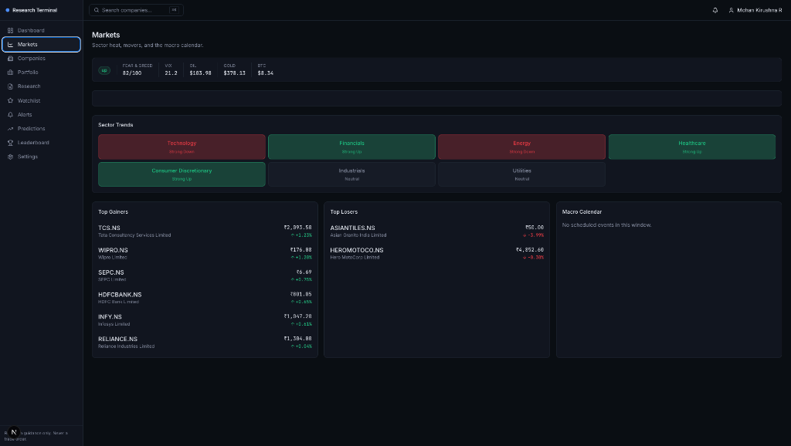
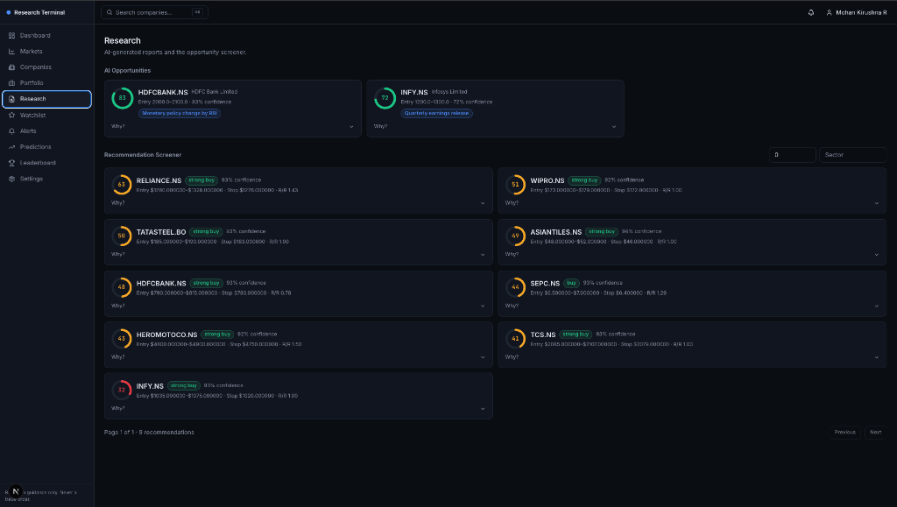
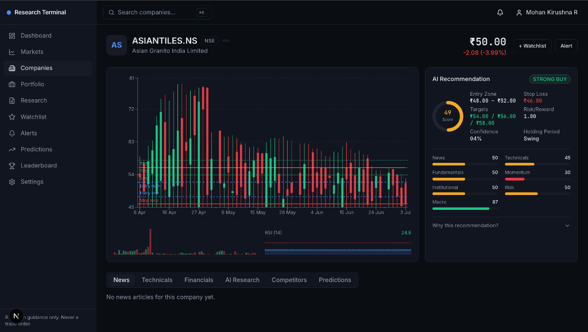

# AI Investment Research Platform

An AI-assisted **research** tool for public equities — market data, news, technical and
fundamental analysis, and AI reasoning combined into a master score and a recommendation
that always explains its *why*. This is not a trading bot: it never executes trades, and
every recommendation ships with an explicit confidence cap and uncertainty note.

> [!WARNING]
> **BASELINE PROJECT DISCLAIMER:** This platform is a **baseline proof-of-concept project** and is intended for research and educational purposes only. The metrics, sentiment analysis, and stock recommendations provided by the AI agents are **not fully trusted or verified** and should not be used for actual trading or financial decisions.

> [!TIP]
> **Opportunities for Future Improvement:**
> To elevate this baseline into a production-grade trading and research engine, the following enhancements and resources are recommended:
> * **Real-Time / Sub-Second News Streams**: Replace the current polled/cached news setup (4-hour intervals) with high-frequency financial news APIs (e.g., Bloomberg Enterprise, Reuters News API, or Dow Jones Newswires) via WebSocket streams for instantaneous sentiment updates.
> * **Fine-Tuned Financial LLMs**: Utilize specialized financial sentiment models (e.g., FinBERT) or fine-tune local models (Ollama/Llama) specifically on financial lexicon to increase analysis precision and reduce API costs.
> * **Order-Book & Depth of Market**: Integrate Level 2 market data feeds (order books, volume profile) to gauge liquidity levels along with basic candlestick trends.


New here? Start with [docs/00-user-guide.md](docs/00-user-guide.md) — a plain-language
walkthrough of what the platform does and how to use it, no code involved. See
[ROADMAP.md](ROADMAP.md) for the full build history and [docs/](docs/) for the original
architecture, database schema, API spec, UI wireframes, and agent-interaction design docs.

## 📸 Screenshots & Key Features

### 1. Market Intelligence Dashboard
Get a high-level overview of global market indices (Fear & Greed Index, VIX, Oil, Gold, BTC), sector trends (Technology, Financials, Energy, Healthcare), top gainers/losers, and scheduled macro calendar events.


### 2. AI Opportunities & Recommendation Screener
Discover high-confidence AI opportunities and screen equities using multi-agent consensus scoring (assessing news, technicals, fundamentals, momentum, risk, and macro factors).


### 3. Deep Equities Analysis & Interactive Charts
Analyze individual tickers with interactive candlestick charts, automated technical levels (support/resistance, RSI), and transparent AI scoring breakdowns with a confidence cap and detailed "why" explanation.


---

## 🤖 Background Agent Architecture

The platform runs a series of specialized background agents (orchestrated via Celery + Redis) to collect data, analyze it, and reason about market opportunities:

- **Data Collection Agent**: Fetches prices, financials, and news articles periodically.
- **Technical Analysis Agent**: Generates technical levels (support, resistance), detects trends, and calculates indicators like RSI and MACD.
- **Fundamental Analysis Agent**: Evaluates company financial stability, growth, valuation ratios, and balance sheet health.
- **News Intelligence Agent**: Computes sentiment, relevance, and importance of incoming news articles.
- **AI Recommendation Agent**: Synthesizes all gathered metrics and reasoning into structured recommendations (entry/exit zones, stop loss, score, confidence, pros/cons).
- **Learning Agent**: Automatically retroactively grades past predictions against real price data to log performance and improve model weights.

---

## ⚙️ Technical Deep Dive & AI Implementation

### 1. Market Data & News Fetching
The platform abstracts market data operations via a clean `MarketDataSource` port interface, allowing different vendors to cover specific capabilities:
* **Market Quotes & Financials**: Pulled from either **Finnhub** (primary REST source for US markets) or **Yahoo Finance** (unofficial free source, primarily utilized to fetch real-time quotes and historical data for Indian NSE/BSE equities like `RELIANCE.NS`).
* **Financial News Aggregation**: Fetched via **Marketaux** (financial news API) or Finnhub. Marketaux is especially key for Indian markets since it maps official tickers to plain search keywords (e.g. searching "Infosys" for `INFY.NS`) and ignores stale articles (restricted to a max age of 30 days).
* **Cache & Rate-Limit Safeguards**: News queries are throttled through Redis. The `CompositeMarketDataSource` caches news lookups for a configurable period (defaulting to 4 hours) to prevent redundant API queries and respect API quotas on free tiers.

### 2. AI Model Selection & Fallback Routing
The system is built on a provider-agnostic `AIProvider` adapter architecture. Concrete API adapters exist for:
* **Cloud LLMs**: Gemini (Google), Claude (Anthropic), OpenAI, DeepSeek, Mistral, and Groq.
* **Aggregators**: OpenRouter.
* **Local Run**: Ollama (defaults to `llama3.1`).

You can customize orchestration dynamically in `.env`:
* **Fallbacks** (`AI__FALLBACK_PROVIDERS`): Defines a chain of backup providers to route requests to if the primary model fails.
* **Overrides** (`AI__AGENT_OVERRIDES`): Directs specific agents to specialized models (e.g. routing the intensive `research` agent to `claude-3-5-sonnet` while delegating `news_intelligence` to a faster, cost-effective model like `gpt-4o-mini`).

### 3. Sentiment Analysis & Consensus Scoring
When unanalyzed articles are fetched, they are passed to the **News Intelligence Agent** for structured sentiment processing:
1. **Factual Prompting**: The agent sends the article title and body to the LLM with a strict prompt:
   > *You are a financial news analyst. Read the article and extract a structured analysis: sentiment, importance, a concise summary, risks, opportunities... Be factual and conservative — do not speculate.*
2. **Structured JSON Extraction**: The LLM output is parsed directly into a `NewsAnalysisOutput` schema containing:
   * `sentiment`: Float value ranging from `-1.0` (very bearish) to `+1.0` (very bullish).
   * `importance`: Integer ranking from `1` (minor update) to `10` (highly market-moving).
   * `summary`: One-sentence summary of the event.
3. **Qdrant Vector Embedding**: The summary is embedded via the active AI provider and saved in Qdrant (`news_embeddings` collection) to enable semantic vector searching of news logs.
4. **Weighted Sentiment Calculation**: When calculating the general stock news rating (`0` to `100`), the platform uses an importance-weighted average:
   \[
   \text{Weighted Sentiment} = \frac{\sum_{i} \left(\text{sentiment}_i \times (\text{importance}_i + 1)\right)}{\sum_{i} (\text{importance}_i + 1)}
   \]
   This score is then clamped and linearly scaled:
   \[
   \text{News Score} = (\text{Weighted Sentiment} \times 50) + 50
   \]

---

## Stack


- **Backend**: Python, FastAPI, SQLAlchemy (async) + Alembic, Celery + Redis, PostgreSQL, Qdrant, WebSockets, Pydantic
- **Frontend**: Next.js 16 (App Router, Turbopack), React 19, TypeScript, Tailwind v4, Recharts, zustand
- **AI providers**: never hardcoded — an `AIProvider` port with adapters for Gemini, Claude, OpenAI, Groq, OpenRouter, Ollama, DeepSeek, and Mistral, selected per-agent via config with a fallback chain

## Quickstart

### 1. Start infrastructure

```bash
cp .env.example .env   # then fill in whichever AI provider key(s) and market-data keys you have
docker compose up -d postgres redis qdrant
```

### 2. Backend

```bash
cd backend
python -m venv .venv && source .venv/bin/activate
pip install -e .
alembic upgrade head
uvicorn app.main:create_app --factory --reload --port 8000
```

Runs at `http://localhost:8000` — interactive docs at `/docs` (non-production only).

Background agents (data collection, analysis, AI agents, alerts) run on Celery. Start a
worker + beat schedule once you want them running on their normal cadence instead of via
the admin console's on-demand "run agent" buttons:

```bash
docker compose --profile workers up -d worker beat
```

### 3. Seed demo data (optional but recommended)

Populates 6 companies across 5 sectors — full price history, technicals, fundamentals,
news, a real recommendation with score breakdown, and prediction history — plus a market
overview snapshot, macro calendar events, and AI opportunities. Safe to re-run (idempotent).

```bash
cd backend
python scripts/seed_demo.py
```

### 4. Frontend

```bash
cd frontend
npm install
cp .env.local.example .env.local   # NEXT_PUBLIC_API_URL=http://localhost:8000
npm run dev
```

Runs at `http://localhost:3000`. Register a new account, then explore the dashboard.

### 5. Admin access

New accounts default to the `user` role. To explore the Admin console (score-weight
tuning, agent run console, AI usage log), promote your account directly in Postgres:

```sql
UPDATE users SET role = 'admin' WHERE email = 'you@example.com';
```

## Testing

```bash
# Backend — 348 tests (unit + integration; integration tests skip automatically
# if Postgres/Redis/Qdrant aren't reachable)
cd backend && python -m pytest

# Backend lint/type-check
ruff check . && mypy app

# Frontend — Vitest + Testing Library
cd frontend && npm test

# Frontend lint/type-check
npm run lint && npx tsc --noEmit
```

## Configuration

All configuration is environment-driven (see `.env.example` for the full list). Nested
groups use `GROUP__FIELD` (e.g. `AI__PROVIDER`, `DB__HOST`). Notable groups:

| Group | Purpose |
|---|---|
| `DB__*` | PostgreSQL connection |
| `REDIS__*` | Cache, pub/sub fan-out, rate-limit counters |
| `QDRANT__*` | Vector store for news/report embeddings |
| `AUTH__*` | JWT TTLs, Google OAuth |
| `AI__*` | Default AI provider, per-agent overrides, fallback chain, provider API keys |
| `MARKET__*` | Market-data provider API keys (Finnhub, Alpha Vantage) |
| `RATE_LIMIT__*` | Per-IP request limits (disabled by default in `backend/.env` for local dev — see below) |

### Rate limiting

Requests are rate-limited per client IP using a Redis fixed-window counter (no extra
infrastructure dependency). Auth endpoints (`/api/v1/auth/login`, `/register`) get a
tighter window than the general API, since those are the classic brute-force targets.
`/api/v1/health` and `/api/v1/health/ready` are exempt so container healthchecks never
trip it. It's disabled in the
checked-in `backend/.env` (rapid local dev/test traffic from one IP would otherwise
throttle itself) — set `RATE_LIMIT__ENABLED=true` for staging/production.

### Observability

- Structured logging (`backend/app/core/logging.py`): human-readable in development,
  one JSON object per line in production.
- Every request gets a correlation ID (generated, or propagated from an inbound
  `X-Request-Id` header), echoed back on the response and bound into every log line
  emitted while handling that request — trace one request across log lines without a
  separate tracing backend.
- `GET /api/v1/health` — liveness. `GET /api/v1/health/ready` — readiness, pings Postgres/Redis/Qdrant.

## Deployment

`docker-compose.yml` at the repo root defines `postgres`, `redis`, `qdrant`, `api`, and
(behind profiles) `worker` + `beat` (`--profile workers`) and `frontend` (`--profile full`).
For a full stack in containers:

```bash
docker compose --profile workers --profile full up -d --build
```

Run Alembic migrations against the containerized Postgres before first use:

```bash
docker compose run --rm api alembic upgrade head
```

In production, set `APP_ENV=production` (switches logging to JSON and disables
`/docs`), a real `APP_SECRET_KEY`, restrict `APP_CORS_ORIGINS` to your real frontend
origin, and enable rate limiting.
